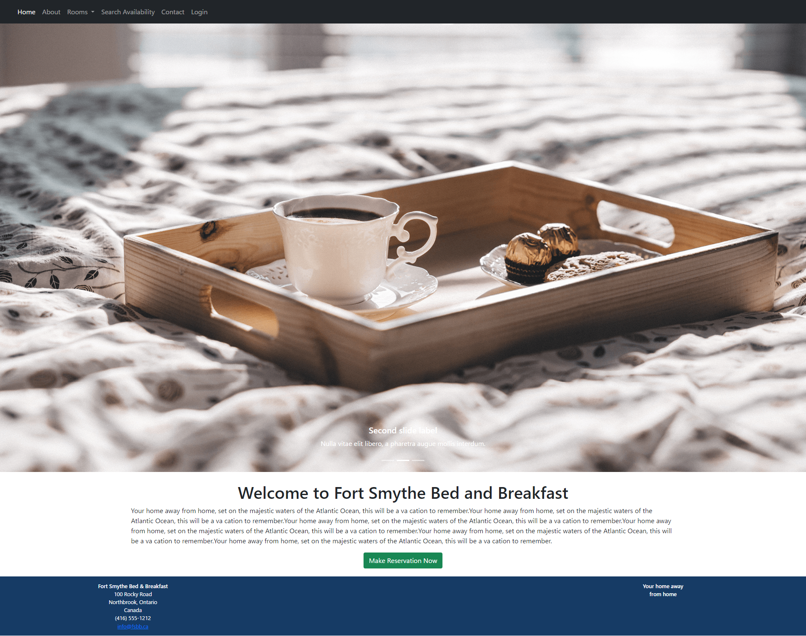
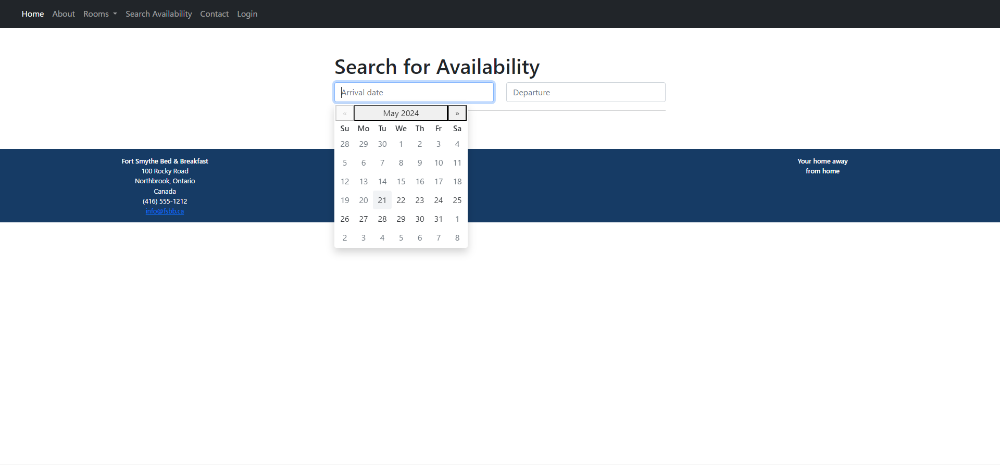
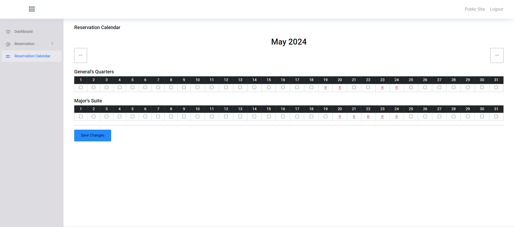
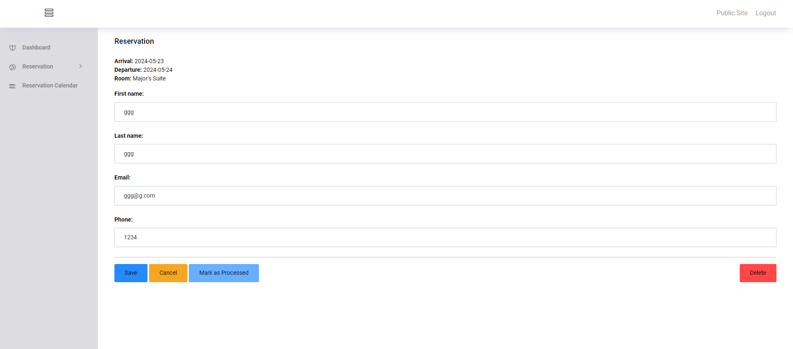
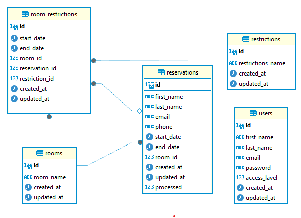

# Bookings and Reservations
## Description
This is a hotel reservation web application developed for learning purposes. Visitors to the site can search for accommodations by date and make online reservations, while the site owner can manage reservations through a secure backend.









## DB Diagram


## App Overview

This reservation app has four main features: checking availability, making reservations, sending emails, and an admin interface for reviewing and modifying reservations.

### 1. Checking Availability

When a user selects their desired dates for a reservation, the application checks the database to verify if a reservation can be made. The application retrieves the `start_date` and `end_date` from the form, then uses this information to search the `room_restrictions` table in the database for available rooms. The application then returns the available room information to the user.

### 2. Making Reservations

Once availability is confirmed and the user selects a room, they proceed by entering their name, email address, and phone number into a form. This information is then added to the database to complete the reservation process.

### 3. Sending Emails

After making a reservation, the application sends confirmation emails to both the user's email address and the administrator. This application uses MailHog as a testing email server.

### 4. Admin Interface

An admin page has been created for reviewing and modifying reservations. Administrators can log in through a login page after their credentials are verified against the database. The admin page allows administrators to view a list of reservations, modify reservation details, cancel reservations, and set restrictions for dates that should not be available for reservations.

## Technologies Used

- **Backend:** Go
- **Frontend:** HTML, CSS, JavaScript
- **Database:** PostgreSQL
- **Email:** MailHog for testing email functionalities

## Getting Started
1. **Clone the repository:**
   ```bash
   git clone https://github.com/jumpei527/bookings.git
   cd bookings
   ```
2. **Install dependencies:**
   ```bash
   go mod tidy
   ```
3. **Edit configuration files:**
   - Edit the database.yml file and run.sh with your database configuration.
4. **Run database migrations:**
   ```bash
   soda migrate
   ```
5. **Download and run MailHog:**
   ```bash
   go install github.com/mailhog/MailHog@latest
   MailHog
   ```
6. **Start the application:**
   ```bash
   ./run.sh
   ```
